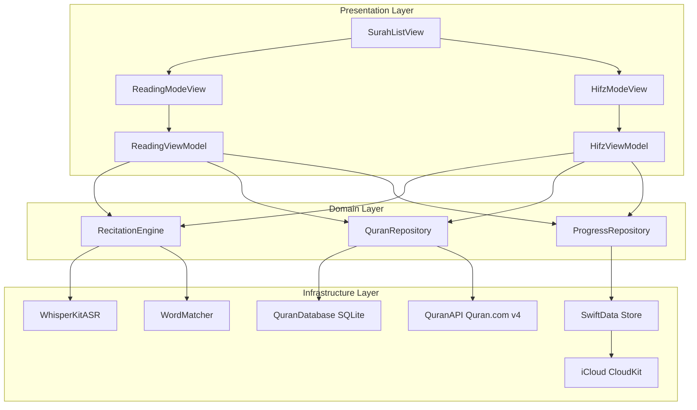

# Design Document: Quran Memorization App

## Overview

Die Quran Memorization App ist eine iOS-Anwendung (Swift/SwiftUI, iOS 16+), die zwei Kernmodi bietet: einen **Lese-Modus** mit Echtzeit-Rezitationsfeedback und einen **Hifz-Modus** mit progressivem Wort-Aufdecken aus dem Gedächtnis. Die technische Kernherausforderung liegt in der vollständig offline-fähigen arabischen Spracherkennung mit Tajweed-Bewusstsein, dem Echtzeit-Wort-für-Wort-Matching gegen eine verifizierte Koran-Datenbank und der persistenten iCloud-Synchronisierung des Lernfortschritts.

### Technische Kernentscheidungen

| Bereich | Entscheidung | Begründung |
|---|---|---|
| Spracherkennung | **WhisperKit** (argmaxinc/WhisperKit) | Apple `SFSpeechRecognizer` unterstützt Arabisch nicht offline. WhisperKit führt Whisper-Modelle on-device auf dem Apple Neural Engine aus — vollständig offline, Swift-nativ, Streaming-fähig. |
| Koran-Datenbank | **Tanzil-Daten (gebundelt) + Quran.com API v4 (online)** | Tanzil liefert verifizierten Unicode-Text (Uthmani-Schrift) als offline-fähige SQLite-Datenbank. Quran.com API v4 ergänzt Wort-Timestamps und Übersetzungen bei Netzwerkverbindung. |
| Persistenz & Sync | **SwiftData + NSPersistentCloudKitContainer** | Nahtlose iCloud-Synchronisierung ohne eigenen Server; automatisches Offline-First-Verhalten. |
| UI-Framework | **SwiftUI** | Deklaratives UI, native RTL-Unterstützung, einfache Animation für progressives Aufdecken. |
| Audio-Ausgabe | **AVFoundation + AVAudioPlayer** | Lokale MP3-Dateien für Referenzrezitation; Wort-Highlighting via vorberechnete Timestamps. |

---

## Architecture

Die App folgt einer **MVVM + Clean Architecture**-Struktur mit klarer Trennung zwischen Datenschicht, Domänenschicht und Präsentationsschicht.



### Schichtenverantwortlichkeiten

- **Presentation Layer**: SwiftUI Views + ViewModels. ViewModels halten den UI-State und delegieren Logik an die Domänenschicht.
- **Domain Layer**: Plattformunabhängige Business-Logik. `RecitationEngine` orchestriert ASR, Matching und State-Übergänge. Repositories abstrahieren Datenzugriff.
- **Infrastructure Layer**: Konkrete Implementierungen — WhisperKit für ASR, SQLite für Koran-Text, SwiftData/CloudKit für Fortschritt.

---

## Components and Interfaces

### 1. RecitationEngine

Zentraler Orchestrator für alle Aufnahme- und Matching-Operationen. Wird von beiden Modi verwendet.

```swift
protocol RecitationEngineProtocol {
    var state: RecitationState { get }
    var wordEvents: AsyncStream<WordMatchEvent> { get }

    func startRecitation(expectedWords: [QuranWord], config: RecitationConfig) async throws
    func stopRecitation() async
    func pauseRecitation() async
    func resumeRecitation() async
}

enum RecitationState {
    case idle
    case recording
    case paused
    case silenceDetected(since: Date)
    case error(RecitationError)
}

struct WordMatchEvent {
    let word: QuranWord
    let transcribedText: String
    let result: MatchResult
    let confidence: Float
    let latencyMs: Int
}

enum MatchResult {
    case correct
    case incorrect(expected: String, got: String)
    case lowConfidence(threshold: Float)
}

struct RecitationConfig {
    var confidenceThreshold: Float = 0.80
    var diacriticMode: DiacriticMode = .moderate
    var silenceTimeoutSeconds: Double = 5.0
    var maxLatencyMs: Int = 550
}

enum DiacriticMode {
    case strict   // exakte Übereinstimmung inkl. Harakat
    case moderate // Übereinstimmung ohne Harakat
}
```

### 2. WhisperKitASR

Adapter für WhisperKit, implementiert das ASR-Interface.

```swift
protocol ASRProvider {
    func transcribeStream(audioBuffer: AVAudioPCMBuffer) async throws -> TranscriptionResult
    func loadModel(modelName: String) async throws
    var isModelLoaded: Bool { get }
}

struct TranscriptionResult {
    let segments: [TranscriptionSegment]
    let language: String
}

struct TranscriptionSegment {
    let text: String
    let startTime: Double
    let endTime: Double
    let confidence: Float
    let words: [WordTimestamp]
}

struct WordTimestamp {
    let word: String
    let startTime: Double
    let endTime: Double
    let confidence: Float
}
```

**Modell-Strategie**: WhisperKit lädt ein fine-getuntes `whisper-small` Modell (~150 MB) für Arabisch. Für Koran-spezifische Verbesserung kann ein auf Koran-Rezitationen fine-getuntes Modell (z.B. von Hugging Face) als CoreML-Modell eingebunden werden. Das Modell wird beim ersten App-Start heruntergeladen und lokal gecacht.

### 3. WordMatcher

Vergleicht transkribierte Wörter mit dem erwarteten Koran-Text.

```swift
protocol WordMatcherProtocol {
    func match(transcribed: String, expected: QuranWord, config: RecitationConfig) -> MatchResult
    func normalizeArabic(_ text: String, mode: DiacriticMode) -> String
}

// Normalisierungsregeln:
// - Strict: Behalte alle Harakat (Fatha, Kasra, Damma, Sukun, Shadda, Tanwin)
// - Moderate: Entferne alle Harakat, normalisiere Alef-Varianten (أ إ آ → ا),
//             normalisiere Ta Marbuta (ة → ه), normalisiere Hamza-Varianten
```

### 4. QuranRepository

Abstrahiert den Zugriff auf Koran-Daten (offline SQLite + optionale Online-API).

```swift
protocol QuranRepositoryProtocol {
    func fetchSurah(number: Int) async throws -> Surah
    func fetchAllSurahs() async throws -> [SurahMetadata]
    func fetchVerses(surahNumber: Int, range: ClosedRange<Int>?) async throws -> [Verse]
    func fetchTranslation(verseKey: String, language: String) async throws -> String?
    func searchSurahs(query: String) async throws -> [SurahMetadata]
}
```

**Datenstrategie**: Die Tanzil-Datenbank (Uthmani-Schrift, ~3 MB) wird als SQLite-Datei im App-Bundle mitgeliefert. Übersetzungen werden bei Bedarf von der Quran.com API v4 heruntergeladen und lokal gecacht.

### 5. ProgressRepository

Verwaltet Lernfortschritt mit SwiftData + iCloud-Sync.

```swift
protocol ProgressRepositoryProtocol {
    func markVerseAsLearned(verseKey: String) async throws
    func getProgress(surahNumber: Int) async throws -> SurahProgress
    func getOverallProgress() async throws -> OverallProgress
    func saveSessionResult(_ result: SessionResult) async throws
    func resumeSession(surahNumber: Int) async throws -> SessionState?
    func getDailyStats(date: Date) async throws -> DailyStats
}
```

### 6. AudioPlayer

Verwaltet Referenzrezitation mit Wort-Synchronisierung.

```swift
protocol AudioPlayerProtocol {
    var currentWordIndex: Published<Int?>.Publisher { get }
    var playbackState: Published<PlaybackState>.Publisher { get }

    func play(verseKey: String, recitatorId: String) async throws
    func pause()
    func stop()
    func downloadRecitator(_ recitatorId: String) async throws -> Progress
}
```

---

## Data Models

### Koran-Datenmodelle (Value Types)

```swift
struct SurahMetadata: Identifiable, Codable {
    let id: Int                    // 1–114
    let nameArabic: String         // e.g. "الفاتحة"
    let nameTransliterated: String // e.g. "Al-Fatihah"
    let verseCount: Int
    let revelationType: RevelationType // .meccan | .medinan
}

struct Surah: Identifiable, Codable {
    let metadata: SurahMetadata
    let verses: [Verse]
}

struct Verse: Identifiable, Codable {
    let id: String          // "1:1" (surah:ayah)
    let surahNumber: Int
    let verseNumber: Int
    let words: [QuranWord]
    let textUthmani: String // vollständiger Vers-Text
}

struct QuranWord: Identifiable, Codable, Equatable {
    let id: String          // "1:1:1" (surah:ayah:word)
    let textUthmani: String // arabischer Text mit Harakat
    let textSimple: String  // arabischer Text ohne Harakat
    let position: Int       // Position im Vers (0-basiert)
    let audioTimestamp: Double? // Sekunden im Referenz-Audio
}
```

### Fortschritts-Datenmodelle (SwiftData, iCloud-sync)

```swift
@Model
final class VerseProgress {
    @Attribute(.unique) var verseKey: String  // "1:1"
    var isLearned: Bool
    var learnedDate: Date?
    var totalAttempts: Int
    var lastPracticed: Date?

    init(verseKey: String) {
        self.verseKey = verseKey
        self.isLearned = false
        self.totalAttempts = 0
    }
}

@Model
final class SessionRecord {
    var id: UUID
    var surahNumber: Int
    var startVerseNumber: Int
    var endVerseNumber: Int
    var startDate: Date
    var endDate: Date?
    var totalDurationSeconds: Double
    var verseAttempts: [VerseAttemptRecord]  // Embedded
    var isCompleted: Bool

    // Für Session-Wiederaufnahme
    var lastCompletedVerseNumber: Int?
}

@Model
final class DailyStats {
    @Attribute(.unique) var date: Date  // Normalisiert auf Mitternacht
    var versespracticed: Int
    var totalDurationSeconds: Double
    var sessionsCount: Int
}

// Nicht-persistentes Modell für aktive Session
struct SessionState {
    var surahNumber: Int
    var verseRange: ClosedRange<Int>
    var currentVerseIndex: Int
    var revealedWords: Set<String>  // Word-IDs der aufgedeckten Wörter
    var attemptCount: Int
    var sessionStartDate: Date
}
```

### Hifz-Modus UI-State

```swift
struct HifzWordState: Identifiable {
    let id: String          // QuranWord.id
    let word: QuranWord
    var visibility: WordVisibility
    var matchResult: MatchResult?
}

enum WordVisibility {
    case hidden             // Noch nicht rezitiert
    case revealed(color: WordColor)  // Aufgedeckt
}

enum WordColor {
    case correct   // Grün — korrekt rezitiert
    case incorrect // Rot — falsch rezitiert
}
```

---

## Correctness Properties

*A property is a characteristic or behavior that should hold true across all valid executions of a system — essentially, a formal statement about what the system should do. Properties serve as the bridge between human-readable specifications and machine-verifiable correctness guarantees.*

### Property 1: Arabische Normalisierung ist idempotent

*For any* arabischen String und beliebigen `DiacriticMode`, die zweifache Anwendung von `normalizeArabic(_:mode:)` soll dasselbe Ergebnis liefern wie die einfache Anwendung: `normalize(normalize(s)) == normalize(s)`.

**Validates: Requirements 4.5**

### Property 2: Strict-Modus ist strenger als Moderate-Modus

*For any* zwei arabische Strings `a` und `b`, wenn sie im Strict-Modus als übereinstimmend bewertet werden, dann stimmen sie auch im Moderate-Modus überein. Die Umkehrung gilt nicht notwendigerweise: `match(a, b, .strict) == .correct → match(a, b, .moderate) == .correct`.

**Validates: Requirements 4.5**

### Property 3: Match-Ergebnis bestimmt Wort-Markierung

*For any* Wort in einem Vers und beliebiges Transkriptionsergebnis, die Wort-Markierung im UI-State soll exakt dem Match-Ergebnis entsprechen: korrekte Transkription → `revealed(.correct)` (grün); falsche Transkription → `revealed(.incorrect)` (rot). Nicht betroffene Wörter bleiben unverändert.

**Validates: Requirements 2.6, 3.2, 3.3, 4.3, 4.4**

### Property 4: Progressives Aufdecken ist monoton

*For any* Hifz-Session und beliebige Sequenz von Match-Events innerhalb eines Versversuchs, die Menge der aufgedeckten Wörter kann nur wachsen — ein einmal aufgedecktes Wort (`revealed`) wird nicht wieder auf `hidden` gesetzt, bis ein expliziter Vers-Reset ausgelöst wird.

**Validates: Requirements 3.2**

### Property 5: Vers-Reset stellt vollständigen Ausgangszustand wieder her

*For any* Hifz-Session und beliebigen Zwischenzustand (beliebige Kombination aus aufgedeckten und versteckten Wörtern), nach einem Aufruf von `resetVerse()` sollen alle `HifzWordState`-Einträge des Verses `visibility == .hidden` und `matchResult == nil` haben.

**Validates: Requirements 3.5, 5.2**

### Property 6: Vollständige Rezitation löst automatischen Vers-Wechsel aus

*For any* Vers mit n Wörtern, sobald alle n Wörter den Status `revealed(.correct)` erhalten haben, soll der aktive Vers-Index automatisch auf den nächsten Vers inkrementiert werden (oder die Session-Zusammenfassung ausgelöst werden, wenn es der letzte Vers war).

**Validates: Requirements 3.4, 5.1**

### Property 7: Fortschritt-Persistenz Round-Trip

*For any* `VerseProgress`-Objekt oder `SessionState`, das gespeichert und anschließend geladen wird, soll das geladene Objekt in allen Feldern äquivalent zum gespeicherten sein (isLearned, attemptCount, lastPracticed, currentVerseIndex, revealedWords).

**Validates: Requirements 5.5, 6.3**

### Property 8: Konfidenz-Schwelle bestimmt Wort-Bewertung

*For any* Transkriptionsergebnis mit Konfidenzwert `c` und konfigurierter Schwelle `t`: wenn `c < t`, soll das Wort als falsch markiert werden, unabhängig vom transkribierten Text; wenn `c >= t` und der normalisierte Text übereinstimmt, soll das Wort als korrekt markiert werden.

**Validates: Requirements 8.2**

### Property 9: Suren-Suche liefert nur relevante Ergebnisse

*For any* nicht-leere Suchanfrage `q`, alle zurückgegebenen `SurahMetadata`-Einträge sollen den Suchbegriff (case-insensitive) entweder im arabischen Namen, im transliterierten Namen oder in der Surennummer enthalten. Eine leere Suchanfrage soll alle 114 Suren zurückgeben.

**Validates: Requirements 1.3**

### Property 10: Versbereich-Filter ist exakt

*For any* Versbereich `[a, b]` (wobei `1 ≤ a ≤ b ≤ verseCount`), die im Hifz-Modus angezeigte Versliste soll genau die Verse mit Nummern `a` bis `b` enthalten — nicht mehr und nicht weniger.

**Validates: Requirements 3.6**

### Property 11: Versuch-Zähler ist korrekt

*For any* Sequenz von `n` Rezitationsversuchen für denselben Vers, der `attemptCount` soll nach der Sequenz genau `n` betragen.

**Validates: Requirements 5.3**

### Property 12: Fortschrittsberechnung ist korrekt

*For any* Sure mit `total` Versen, von denen `learned` als gelernt markiert sind (wobei `0 ≤ learned ≤ total`), soll der angezeigte Prozentsatz gleich `(learned / total) * 100` sein (gerundet auf ganze Zahlen).

**Validates: Requirements 6.1, 6.2**

### Property 13: Audio-Wort-Highlighting ist synchron

*For any* Wiedergabe-Timestamp `t`, der hervorgehobene Wort-Index soll dem Wort entsprechen, dessen `audioTimestamp`-Intervall `t` enthält (d.h. `word[i].audioTimestamp ≤ t < word[i+1].audioTimestamp`).

**Validates: Requirements 7.3**

### Property 14: Kalibrierungsempfehlung bei hoher Fehlerrate

*For any* Vers mit `n` Wörtern, wenn mehr als `⌊n * 0.3⌋` Wörter einen Konfidenzwert unterhalb der Schwelle zurückgeben, soll die App eine Kalibrierungsempfehlung anzeigen.

**Validates: Requirements 8.4**

---

## Error Handling

### Fehlertypen und Behandlung

```swift
enum QuranAppError: LocalizedError {
    // ASR-Fehler
    case asrModelNotLoaded
    case asrModelDownloadFailed(underlying: Error)
    case microphonePermissionDenied
    case audioSessionInterrupted

    // Daten-Fehler
    case surahNotFound(number: Int)
    case databaseCorrupted
    case translationUnavailable(language: String)
    case networkUnavailable

    // Session-Fehler
    case sessionSaveFailed(underlying: Error)
    case iCloudSyncFailed(underlying: Error)
}
```

### Fehlerbehandlungs-Strategie

| Fehlerfall | Verhalten |
|---|---|
| Mikrofon-Berechtigung verweigert | Einmaliger System-Dialog; bei Ablehnung: Hinweis mit Link zu Einstellungen, Aufnahme-Button deaktiviert |
| WhisperKit-Modell nicht geladen | Ladeindikator beim App-Start; bei Fehler: Retry-Button + Offline-Hinweis |
| Koran-Datenbank nicht lesbar | Kritischer Fehler-Screen mit Support-Kontakt; App kann nicht fortfahren |
| Übersetzung nicht verfügbar | Stille Degradation: arabischer Text ohne Übersetzung, Info-Toast |
| iCloud-Sync-Fehler | Lokale Daten bleiben erhalten; Sync-Status-Indikator in Einstellungen; kein Datenverlust |
| Stille > 5 Sekunden | Aufnahme pausieren, visuelles Puls-Signal, Tap-to-Resume |
| Latenz > 550 ms | Warnung im Debug-Modus; in Production: stille Degradation, kein Abbruch |
| Session-Unterbrechung (Anruf, Hintergrund) | Sofortiges Pausieren, Zustand speichern, bei Rückkehr: Wiederaufnahme-Dialog |

### Offline-First-Strategie

```
App-Start
├── Koran-Datenbank: Immer aus Bundle (offline, kein Netzwerk nötig)
├── WhisperKit-Modell: Aus lokalem Cache (nach erstem Download)
├── Übersetzungen: Aus lokalem Cache (falls vorhanden) oder API
├── Referenz-Audio: Aus lokalem Cache (falls heruntergeladen) oder API
└── Fortschritt: SwiftData lokal, iCloud-Sync wenn verfügbar
```

---

## Testing Strategy

### Dual Testing Approach

Die App verwendet eine Kombination aus Unit-Tests, Property-Based Tests und Integrationstests.

#### Property-Based Testing

**Framework**: [swift-testing](https://github.com/apple/swift-testing) + [SwiftCheck](https://github.com/typelift/SwiftCheck) für Property-Based Tests.

Jeder Property-Test läuft mit mindestens **100 Iterationen**. Tag-Format: `Feature: quran-memorization-app, Property {N}: {property_text}`

| Property | Test-Fokus | Generator |
|---|---|---|
| P1: Normalisierung idempotent | `WordMatcher.normalizeArabic` | Zufällige arabische Strings (U+0600–U+06FF) mit/ohne Harakat |
| P2: Strict strenger als Moderate | `WordMatcher.match` | Zufällige arabische Wortpaare |
| P3: Match-Ergebnis bestimmt Markierung | `HifzViewModel` + `ReadingViewModel` | Zufällige Wörter + Transkriptionen |
| P4: Monotones Aufdecken | `HifzViewModel` State-Transitions | Zufällige Sequenzen von Match-Events |
| P5: Vers-Reset | `HifzViewModel.resetVerse()` | Beliebige Zwischenzustände (teilweise aufgedeckt) |
| P6: Auto-Advance nach vollständiger Rezitation | `HifzViewModel` | Zufällige Verse mit n Wörtern |
| P7: Fortschritt Round-Trip | `ProgressRepository` | Zufällige VerseProgress + SessionState-Objekte |
| P8: Konfidenz-Schwelle | `RecitationEngine` / `WordMatcher` | Zufällige Konfidenzwerte + Schwellen |
| P9: Suren-Suche | `QuranRepository.searchSurahs` | Zufällige Suchanfragen (leer, Teilstring, Nummer) |
| P10: Versbereich-Filter | `HifzViewModel` Init | Zufällige gültige Versbereiche |
| P11: Versuch-Zähler | `HifzViewModel` | Zufällige Sequenzen von Versuchen |
| P12: Fortschrittsberechnung | `ProgressRepository.getProgress` | Zufällige Mengen gelernter Verse |
| P13: Audio-Wort-Highlighting | `AudioPlayer` | Zufällige Timestamps innerhalb eines Verses |
| P14: Kalibrierungsempfehlung | `RecitationEngine` | Zufällige Konfidenzverteilungen über Verse |

#### Unit Tests

- `WordMatcher`: Konkrete Beispiele für Tajweed-Normalisierung (Alef-Varianten, Hamza, Ta Marbuta)
- `QuranRepository`: Laden von Surah 1 (Al-Fatihah) als Smoke-Test der SQLite-Datenbank
- `HifzViewModel`: Vollständiger Vers-Durchlauf (alle Wörter korrekt → Auto-Advance)
- `SessionRecord`: Serialisierung/Deserialisierung von Session-Daten
- `AudioPlayer`: Wort-Highlighting-Synchronisierung mit Mock-Timestamps

#### Integrationstests

- WhisperKit-Modell-Ladezeit (< 3 Sekunden auf iPhone 12+)
- End-to-End: Aufnahme → Transkription → Matching → UI-Update (mit Test-Audio-Fixtures)
- iCloud-Sync: Lokale Änderung → CloudKit-Upload (erfordert iCloud-Test-Account)

#### Nicht durch PBT abgedeckt

- **UI-Rendering**: Snapshot-Tests für RTL-Textdarstellung, Dark/Light Mode
- **VoiceOver**: Manuelle Accessibility-Tests mit aktiviertem Screenreader
- **Tajweed-Modell-Qualität**: Manuelle Evaluation mit Referenz-Rezitationen

### Testdaten

- **Koran-Fixtures**: Al-Fatihah (Surah 1, 7 Verse) als vollständige Test-Sure
- **Audio-Fixtures**: Voraufgezeichnete korrekte und fehlerhafte Rezitationen für deterministische Tests
- **Arabische String-Generatoren**: SwiftCheck-Generatoren für arabische Unicode-Zeichen (U+0600–U+06FF) mit und ohne Harakat
