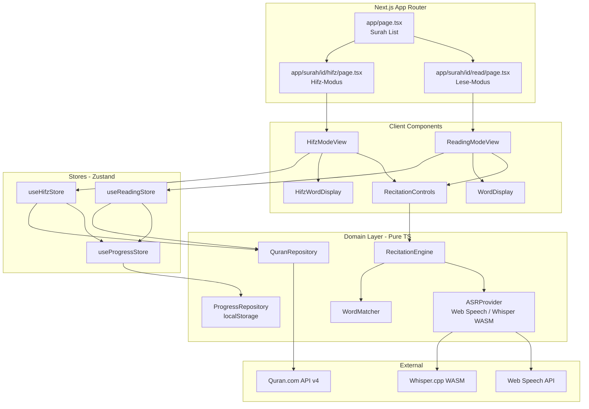
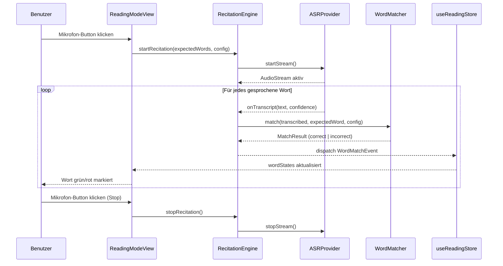
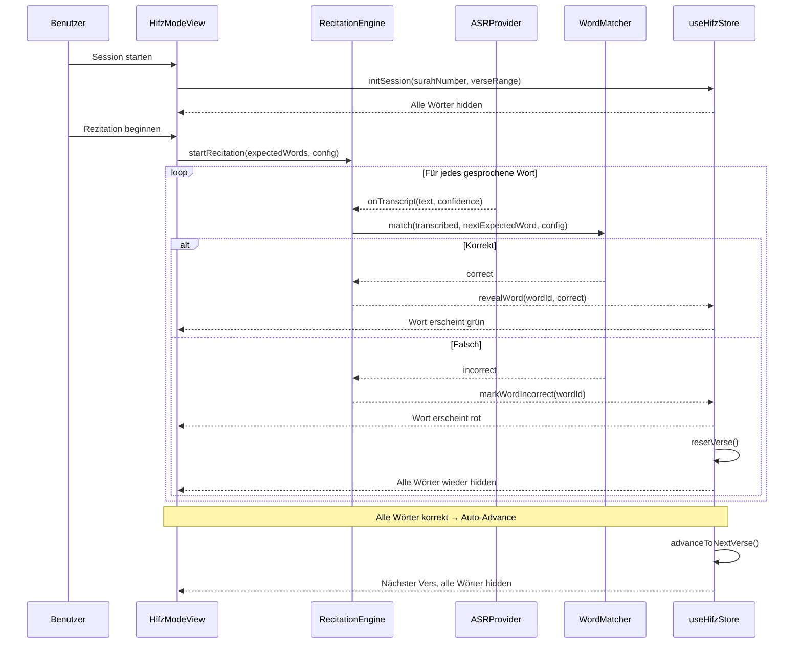

# Design Document: Quran Memorization Web App

## Overview

Die Quran Memorization Web App ist eine Next.js 14-Anwendung (App Router, TypeScript), die die Kernfunktionalität der iOS-Schwester-App ins Web bringt: einen **Lese-Modus** mit Echtzeit-Rezitationsfeedback und einen **Hifz-Modus** mit progressivem Wort-Aufdecken aus dem Gedächtnis. Die technische Kernherausforderung liegt in der browsernativen arabischen Spracherkennung (Web Speech API + Whisper.cpp/WASM als Fallback), dem Echtzeit-Wort-für-Wort-Matching gegen die Quran.com API v4 und der persistenten Fortschrittsspeicherung via localStorage (Gast) bzw. optionalem Account-System.

Die Web-App erfüllt dieselben 14 Correctness Properties wie die iOS-App, implementiert sie jedoch mit Web-Technologien: TypeScript-Interfaces statt Swift-Protokolle, Zustand/Jotai statt SwiftData, Web Speech API/Whisper.cpp statt WhisperKit, und Vitest + fast-check statt SwiftCheck.

### Technische Kernentscheidungen

| Bereich | Entscheidung | Begründung |
|---|---|---|
| Framework | **Next.js 14+ (App Router)** | SSR für initiales Laden, Client Components für interaktive Modi, optimales SEO |
| Spracherkennung | **Web Speech API (primär) + Whisper.cpp/WASM (Fallback)** | Web Speech API ist nativ, kein Download; Whisper.cpp/WASM für bessere Arabisch-Unterstützung in Browsern ohne native Arabisch-ASR |
| Koran-Daten | **Quran.com API v4** | Vollständige Wort-Daten, Übersetzungen, Audio-Timestamps; kein eigenes Backend für MVP |
| State Management | **Zustand** | Minimaler Boilerplate, React-freundlich, einfache Persistenz via `persist`-Middleware |
| Styling | **Tailwind CSS** | Utility-first, konsistent mit Quran.com-Ästhetik, RTL-Support via `dir="rtl"` |
| Testing | **Vitest + fast-check** | Vitest für Unit/Integration, fast-check für Property-Based Tests (PBT) |
| Persistenz | **localStorage (Gast) + optionales Backend (Account)** | Offline-first für MVP; Account-System als optionale Erweiterung |


---

## Architecture

Die App folgt einer **Feature-Slice-Architektur** innerhalb von Next.js App Router, mit klarer Trennung zwischen Server Components (Datenabruf), Client Components (Interaktivität) und einer plattformunabhängigen Domänenschicht.



### Schichtenverantwortlichkeiten

- **Next.js App Router**: Routing, Server-Side Rendering für initiales Laden, Metadaten
- **Client Components**: Interaktive UI-Elemente, Mikrofon-Steuerung, Wort-Highlighting
- **Zustand Stores**: Reaktiver UI-State, Persistenz via `persist`-Middleware
- **Domain Layer**: Plattformunabhängige Business-Logik in reinem TypeScript (testbar ohne Browser)
- **External**: Quran.com API v4 für Koran-Daten, Browser-APIs für Spracherkennung


---

## Sequence Diagrams

### Lese-Modus: Rezitation mit Echtzeit-Feedback



### Hifz-Modus: Progressives Aufdecken




---

## Data Models

### Koran-Datenmodelle (Value Types)

```typescript
// Entspricht SurahMetadata in der iOS-App
interface SurahMetadata {
  readonly id: number;                  // 1–114
  readonly nameArabic: string;          // z.B. "الفاتحة"
  readonly nameTransliterated: string;  // z.B. "Al-Fatihah"
  readonly nameTranslation: string;     // z.B. "The Opening"
  readonly verseCount: number;
  readonly revelationType: 'meccan' | 'medinan';
}

// Entspricht Surah in der iOS-App
interface Surah {
  readonly metadata: SurahMetadata;
  readonly verses: Verse[];
}

// Entspricht Verse in der iOS-App
interface Verse {
  readonly id: string;           // "1:1" (surah:ayah)
  readonly surahNumber: number;
  readonly verseNumber: number;
  readonly words: QuranWord[];
  readonly textUthmani: string;  // vollständiger Vers-Text
}

// Entspricht QuranWord in der iOS-App
interface QuranWord {
  readonly id: string;              // "1:1:1" (surah:ayah:word)
  readonly textUthmani: string;     // arabischer Text mit Harakat
  readonly textSimple: string;      // arabischer Text ohne Harakat
  readonly position: number;        // Position im Vers (0-basiert)
  readonly audioTimestamp?: number; // Sekunden im Referenz-Audio
}

// Übersetzung (Web-spezifisch, von Quran.com API)
interface Translation {
  readonly verseId: string;
  readonly language: string;  // ISO 639-1, z.B. "de", "en"
  readonly text: string;
}
```

### Fortschritts-Datenmodelle (localStorage-serialisierbar)

```typescript
// Entspricht VerseProgress (@Model) in der iOS-App
interface VerseProgress {
  verseKey: string;       // "1:1"
  isLearned: boolean;
  learnedDate?: string;   // ISO 8601
  totalAttempts: number;
  lastPracticed?: string; // ISO 8601
}

// Entspricht SessionRecord (@Model) in der iOS-App
interface SessionRecord {
  id: string;             // UUID
  surahNumber: number;
  startVerseNumber: number;
  endVerseNumber: number;
  startDate: string;      // ISO 8601
  endDate?: string;       // ISO 8601
  totalDurationSeconds: number;
  verseAttempts: VerseAttemptRecord[];
  isCompleted: boolean;
  lastCompletedVerseNumber?: number;
}

interface VerseAttemptRecord {
  verseKey: string;
  attemptCount: number;
  wasSuccessful: boolean;
}

// Entspricht DailyStats (@Model) in der iOS-App
interface DailyStats {
  date: string;           // ISO 8601, normalisiert auf Mitternacht
  versesPracticed: number;
  totalDurationSeconds: number;
  sessionsCount: number;
}

// Nicht-persistenter State für aktive Session
interface SessionState {
  surahNumber: number;
  verseRange: [number, number]; // [start, end] inklusiv
  currentVerseIndex: number;
  revealedWordIds: Set<string>; // Word-IDs der aufgedeckten Wörter
  attemptCount: number;
  sessionStartDate: string;     // ISO 8601
}
```

### Hifz-Modus UI-State

```typescript
// Entspricht HifzWordState in der iOS-App
interface HifzWordState {
  readonly id: string;       // QuranWord.id
  readonly word: QuranWord;
  visibility: WordVisibility;
  matchResult?: MatchResult;
}

type WordVisibility =
  | { kind: 'hidden' }
  | { kind: 'revealed'; color: WordColor };

type WordColor = 'correct' | 'incorrect';

// Lese-Modus UI-State
interface ReadingWordState {
  readonly id: string;
  readonly word: QuranWord;
  matchResult?: MatchResult;
}
```


---

## Components and Interfaces

### 1. RecitationEngine

Zentraler Orchestrator für alle Aufnahme- und Matching-Operationen. Wird von beiden Modi verwendet. Entspricht `RecitationEngineProtocol` in der iOS-App.

```typescript
type RecitationState =
  | { kind: 'idle' }
  | { kind: 'recording' }
  | { kind: 'paused' }
  | { kind: 'silenceDetected'; since: Date }
  | { kind: 'error'; error: RecitationError };

interface WordMatchEvent {
  word: QuranWord;
  transcribedText: string;
  result: MatchResult;
  confidence: number;   // 0.0–1.0
  latencyMs: number;
}

type MatchResult =
  | { kind: 'correct' }
  | { kind: 'incorrect'; expected: string; got: string }
  | { kind: 'lowConfidence'; threshold: number };

interface RecitationConfig {
  confidenceThreshold: number;  // Standard: 0.80
  diacriticMode: DiacriticMode; // Standard: 'moderate'
  silenceTimeoutSeconds: number; // Standard: 5.0
  maxLatencyMs: number;          // Standard: 550
}

type DiacriticMode = 'strict' | 'moderate';

interface RecitationEngine {
  readonly state: RecitationState;
  startRecitation(expectedWords: QuranWord[], config: RecitationConfig): Promise<void>;
  stopRecitation(): Promise<void>;
  pauseRecitation(): Promise<void>;
  resumeRecitation(): Promise<void>;
  onWordMatch(callback: (event: WordMatchEvent) => void): () => void; // returns unsubscribe
}
```

### 2. ASRProvider

Abstraktion über Web Speech API und Whisper.cpp/WASM. Entspricht `ASRProvider` in der iOS-App.

```typescript
interface TranscriptionResult {
  segments: TranscriptionSegment[];
  language: string;
}

interface TranscriptionSegment {
  text: string;
  startTime: number;
  endTime: number;
  confidence: number;
  words: WordTimestamp[];
}

interface WordTimestamp {
  word: string;
  startTime: number;
  endTime: number;
  confidence: number;
}

interface ASRProvider {
  readonly isAvailable: boolean;
  readonly isModelLoaded: boolean;
  startStream(language: string): Promise<void>;
  stopStream(): Promise<void>;
  onTranscript(callback: (result: TranscriptionSegment) => void): () => void;
  loadModel?(modelName: string): Promise<void>; // nur für Whisper WASM
}

// Konkrete Implementierungen:
// class WebSpeechASRProvider implements ASRProvider { ... }
// class WhisperWasmASRProvider implements ASRProvider { ... }
```

**ASR-Strategie**: `WebSpeechASRProvider` wird bevorzugt (kein Download, nativ). Falls der Browser kein Arabisch unterstützt oder `SpeechRecognition` nicht verfügbar ist, wird `WhisperWasmASRProvider` geladen (Whisper.cpp via WebAssembly, ~150 MB Modell, gecacht in IndexedDB).

### 3. WordMatcher

Vergleicht transkribierte Wörter mit dem erwarteten Koran-Text. Entspricht `WordMatcherProtocol` in der iOS-App.

```typescript
interface WordMatcher {
  match(transcribed: string, expected: QuranWord, config: RecitationConfig): MatchResult;
  normalizeArabic(text: string, mode: DiacriticMode): string;
}

// Normalisierungsregeln (identisch zur iOS-App):
// - strict:   Behalte alle Harakat (Fatha, Kasra, Damma, Sukun, Shadda, Tanwin)
// - moderate: Entferne alle Harakat, normalisiere Alef-Varianten (أ إ آ → ا),
//             normalisiere Ta Marbuta (ة → ه), normalisiere Hamza-Varianten
```

### 4. QuranRepository

Abstrahiert den Zugriff auf Koran-Daten via Quran.com API v4 mit lokalem Cache.

```typescript
interface QuranRepository {
  fetchSurah(number: number): Promise<Surah>;
  fetchAllSurahs(): Promise<SurahMetadata[]>;
  fetchVerses(surahNumber: number, range?: [number, number]): Promise<Verse[]>;
  fetchTranslation(verseKey: string, language: string): Promise<string | null>;
  searchSurahs(query: string): Promise<SurahMetadata[]>;
}

// Cache-Strategie: SWR (stale-while-revalidate) via Next.js fetch() mit
// revalidate: 86400 (24h) für Koran-Daten (unveränderlich)
```

### 5. ProgressRepository

Verwaltet Lernfortschritt mit localStorage (Gast) oder optionalem Backend (Account).

```typescript
interface ProgressRepository {
  markVerseAsLearned(verseKey: string): Promise<void>;
  getProgress(surahNumber: number): Promise<SurahProgress>;
  getOverallProgress(): Promise<OverallProgress>;
  saveSessionResult(result: SessionRecord): Promise<void>;
  resumeSession(surahNumber: number): Promise<SessionState | null>;
  getDailyStats(date: Date): Promise<DailyStats>;
}

interface SurahProgress {
  surahNumber: number;
  totalVerses: number;
  learnedVerses: number;
  percentComplete: number; // Math.round((learned / total) * 100)
}

interface OverallProgress {
  totalVerses: number;      // 6236
  learnedVerses: number;
  percentComplete: number;
  surahProgress: SurahProgress[];
}
```


### 6. Zustand Stores

```typescript
// useReadingStore — Lese-Modus State
interface ReadingStore {
  // State
  currentSurah: Surah | null;
  wordStates: Map<string, ReadingWordState>;
  recitationState: RecitationState;
  fontSize: 'small' | 'medium' | 'large'; // 14pt | 20pt | 28pt
  activeTranslationLanguage: string | null;
  currentVisibleVerseNumber: number;

  // Actions
  loadSurah(surahNumber: number): Promise<void>;
  startRecitation(): Promise<void>;
  stopRecitation(): Promise<void>;
  setFontSize(size: 'small' | 'medium' | 'large'): void;
  setTranslationLanguage(language: string | null): void;
  handleWordMatchEvent(event: WordMatchEvent): void;
}

// useHifzStore — Hifz-Modus State
interface HifzStore {
  // State
  session: SessionState | null;
  currentVerse: Verse | null;
  wordStates: Map<string, HifzWordState>;
  recitationState: RecitationState;
  attemptCount: number;
  isSessionComplete: boolean;

  // Actions
  initSession(surahNumber: number, verseRange: [number, number]): Promise<void>;
  startRecitation(): Promise<void>;
  stopRecitation(): Promise<void>;
  resetVerse(): void;
  advanceToNextVerse(): void;
  handleWordMatchEvent(event: WordMatchEvent): void;
  completeSession(): Promise<SessionRecord>;
}

// useProgressStore — Fortschritt (persistiert via localStorage)
interface ProgressStore {
  verseProgress: Record<string, VerseProgress>;
  sessionHistory: SessionRecord[];
  dailyStats: Record<string, DailyStats>;

  markVerseAsLearned(verseKey: string): void;
  saveSession(record: SessionRecord): void;
  getProgressForSurah(surahNumber: number): SurahProgress;
}
```

---

## Key Functions mit Formalen Spezifikationen

### normalizeArabic()

```typescript
function normalizeArabic(text: string, mode: DiacriticMode): string
```

**Vorbedingungen:**
- `text` ist ein gültiger Unicode-String (darf leer sein)
- `mode` ist `'strict'` oder `'moderate'`

**Nachbedingungen:**
- Rückgabewert ist ein String (nie `null`/`undefined`)
- Im `strict`-Modus: Alle Harakat bleiben erhalten; nur Normalisierung von Whitespace
- Im `moderate`-Modus: Alle Harakat entfernt (U+064B–U+065F, U+0670); Alef-Varianten (U+0622, U+0623, U+0625) → U+0627; Ta Marbuta (U+0629) → U+0647; Hamza-Varianten normalisiert
- Keine Seiteneffekte auf den Eingabe-String

**Loop-Invarianten:** N/A (zeichenweise Transformation)

### match()

```typescript
function match(transcribed: string, expected: QuranWord, config: RecitationConfig): MatchResult
```

**Vorbedingungen:**
- `transcribed` ist ein nicht-leerer String
- `expected` ist ein gültiges `QuranWord`-Objekt
- `config.confidenceThreshold` liegt im Bereich [0.0, 1.0]

**Nachbedingungen:**
- Gibt genau einen der drei `MatchResult`-Typen zurück
- Wenn `confidence < config.confidenceThreshold`: gibt `{ kind: 'lowConfidence' }` zurück
- Wenn `normalizeArabic(transcribed, mode) === normalizeArabic(expected.textUthmani, mode)`: gibt `{ kind: 'correct' }` zurück
- Sonst: gibt `{ kind: 'incorrect', expected, got }` zurück

### resetVerse() (HifzStore)

```typescript
function resetVerse(): void
```

**Vorbedingungen:**
- `session` ist nicht `null`
- `currentVerse` ist nicht `null`

**Nachbedingungen:**
- Alle `HifzWordState`-Einträge des aktuellen Verses haben `visibility: { kind: 'hidden' }`
- Alle `matchResult`-Felder sind `undefined`
- `session.revealedWordIds` ist leer (für den aktuellen Vers)
- `attemptCount` wird um 1 erhöht

### advanceToNextVerse() (HifzStore)

```typescript
function advanceToNextVerse(): void
```

**Vorbedingungen:**
- Alle Wörter des aktuellen Verses haben `visibility.kind === 'revealed'` und `visibility.color === 'correct'`
- `session` ist nicht `null`

**Nachbedingungen:**
- Wenn `currentVerseIndex < verseRange[1]`: `currentVerseIndex` wird inkrementiert, alle Wörter des neuen Verses sind `hidden`
- Wenn `currentVerseIndex === verseRange[1]`: `isSessionComplete` wird `true`


---

## Correctness Properties

*Eine Property ist eine Eigenschaft oder ein Verhalten, das für alle gültigen Ausführungen eines Systems gelten soll — im Wesentlichen eine formale Aussage darüber, was das System tun soll. Die folgenden 14 Properties sind direkte Entsprechungen der iOS-App-Properties, angepasst für TypeScript/Web.*

### Property 1: Arabische Normalisierung ist idempotent

*Für jeden* arabischen String `s` und beliebigen `DiacriticMode` soll die zweifache Anwendung von `normalizeArabic(s, mode)` dasselbe Ergebnis liefern wie die einfache Anwendung:

```typescript
// fast-check Property:
fc.property(fc.string(), fc.constantFrom('strict', 'moderate'), (s, mode) => {
  const once = normalizeArabic(s, mode);
  const twice = normalizeArabic(once, mode);
  return once === twice;
});
```

**Validates: Requirements 4.5**

*Idempotenz-Eigenschaft: Normalisierung ist eine reine Transformation ohne Seiteneffekte.*

### Property 2: Strict-Modus ist strenger als Moderate-Modus

*Für alle* arabischen Strings `a` und `b`: wenn sie im Strict-Modus als übereinstimmend bewertet werden, dann stimmen sie auch im Moderate-Modus überein. Die Umkehrung gilt nicht notwendigerweise:

```typescript
// fast-check Property:
fc.property(arabicStringArb, arabicStringArb, wordArb, configArb, (a, b, word, config) => {
  const strictResult = match(a, { ...word, textUthmani: b }, { ...config, diacriticMode: 'strict' });
  const moderateResult = match(a, { ...word, textUthmani: b }, { ...config, diacriticMode: 'moderate' });
  if (strictResult.kind === 'correct') {
    return moderateResult.kind === 'correct';
  }
  return true; // Implikation: strict correct → moderate correct
});
```

**Validates: Requirements 4.5**

*Metamorphische Eigenschaft: Strict impliziert Moderate — eine strengere Bedingung impliziert die schwächere.*

### Property 3: Match-Ergebnis bestimmt Wort-Markierung

*Für jedes* Wort in einem Vers und beliebiges Transkriptionsergebnis soll die Wort-Markierung im UI-State exakt dem Match-Ergebnis entsprechen: korrekte Transkription → `revealed({ color: 'correct' })`; falsche Transkription → `revealed({ color: 'incorrect' })`. Nicht betroffene Wörter bleiben unverändert:

```typescript
// fast-check Property:
fc.property(wordArb, transcriptionArb, configArb, (word, transcription, config) => {
  const result = match(transcription.text, word, config);
  const state = applyMatchEvent({ word, transcribedText: transcription.text, result, ... });
  if (result.kind === 'correct') return state.visibility.kind === 'revealed' && state.visibility.color === 'correct';
  if (result.kind === 'incorrect') return state.visibility.kind === 'revealed' && state.visibility.color === 'incorrect';
  return true;
});
```

**Validates: Requirements 2.6, 3.2, 3.3, 4.3, 4.4**

*Invariante: Die UI-Markierung ist eine direkte Funktion des Match-Ergebnisses.*

### Property 4: Progressives Aufdecken ist monoton

*Für jede* Hifz-Session und beliebige Sequenz von Match-Events innerhalb eines Versversuchs kann die Menge der aufgedeckten Wörter nur wachsen — ein einmal aufgedecktes Wort wird nicht wieder auf `hidden` gesetzt, bis ein expliziter `resetVerse()` ausgelöst wird:

```typescript
// fast-check Property:
fc.property(verseArb, matchEventSequenceArb, (verse, events) => {
  const store = createHifzStore(verse);
  let revealedCount = 0;
  for (const event of events) {
    store.handleWordMatchEvent(event);
    const newCount = countRevealedWords(store.wordStates);
    // Monotonie: Anzahl aufgedeckter Wörter kann nur wachsen (ohne Reset)
    expect(newCount).toBeGreaterThanOrEqual(revealedCount);
    revealedCount = newCount;
  }
});
```

**Validates: Requirements 3.2**

*Monotonie-Invariante: Aufgedeckte Wörter können innerhalb eines Versversuchs nicht wieder versteckt werden.*

### Property 5: Vers-Reset stellt vollständigen Ausgangszustand wieder her

*Für jeden* beliebigen Zwischenzustand (beliebige Kombination aus aufgedeckten und versteckten Wörtern) sollen nach `resetVerse()` alle `HifzWordState`-Einträge des Verses `visibility.kind === 'hidden'` und `matchResult === undefined` haben:

```typescript
// fast-check Property:
fc.property(verseArb, partialRevealStateArb, (verse, partialState) => {
  const store = createHifzStoreWithState(verse, partialState);
  store.resetVerse();
  return [...store.wordStates.values()].every(
    ws => ws.visibility.kind === 'hidden' && ws.matchResult === undefined
  );
});
```

**Validates: Requirements 3.3, 3.5, 5.2**

*Round-Trip-Eigenschaft: Reset bringt den Vers in den definierten Ausgangszustand zurück.*

### Property 6: Vollständige Rezitation löst automatischen Vers-Wechsel aus

*Für jeden* Vers mit `n` Wörtern: sobald alle `n` Wörter den Status `revealed({ color: 'correct' })` erhalten haben, soll der aktive Vers-Index automatisch inkrementiert werden (oder `isSessionComplete` auf `true` gesetzt werden, wenn es der letzte Vers war):

```typescript
// fast-check Property:
fc.property(verseArb, fc.boolean(), (verse, isLastVerse) => {
  const store = createHifzStore(verse, { isLastVerse });
  revealAllWordsCorrectly(store, verse.words);
  if (isLastVerse) {
    return store.isSessionComplete === true;
  } else {
    return store.session!.currentVerseIndex === initialIndex + 1;
  }
});
```

**Validates: Requirements 3.4, 5.1**

*Invariante: Vollständige korrekte Rezitation löst immer den Vers-Wechsel aus.*

### Property 7: Fortschritt-Persistenz Round-Trip

*Für jedes* `VerseProgress`-Objekt oder `SessionState`, das in localStorage gespeichert und anschließend geladen wird, soll das geladene Objekt in allen Feldern äquivalent zum gespeicherten sein:

```typescript
// fast-check Property:
fc.property(verseProgressArb, (progress) => {
  const repo = createLocalStorageProgressRepository();
  repo.saveVerseProgress(progress);
  const loaded = repo.loadVerseProgress(progress.verseKey);
  return deepEqual(progress, loaded);
});
```

**Validates: Requirements 5.5, 6.3**

*Round-Trip-Eigenschaft: Serialisierung → Deserialisierung aus localStorage ist verlustfrei.*

### Property 8: Konfidenz-Schwelle bestimmt Wort-Bewertung

*Für jedes* Transkriptionsergebnis mit Konfidenzwert `c` und konfigurierter Schwelle `t`: wenn `c < t`, soll das Wort als `lowConfidence` markiert werden, unabhängig vom transkribierten Text; wenn `c >= t` und der normalisierte Text übereinstimmt, soll das Wort als korrekt markiert werden:

```typescript
// fast-check Property:
fc.property(fc.float({ min: 0, max: 1 }), fc.float({ min: 0, max: 1 }), wordArb, (confidence, threshold, word) => {
  const config = { ...defaultConfig, confidenceThreshold: threshold };
  const result = matchWithConfidence(word.textUthmani, word, confidence, config);
  if (confidence < threshold) return result.kind === 'lowConfidence';
  return true; // Wenn confidence >= threshold, hängt Ergebnis vom Text ab
});
```

**Validates: Requirements 8.2**

*Invariante: Die Konfidenz-Schwelle ist eine harte Grenze — kein Wort unter der Schwelle wird als korrekt markiert.*

### Property 9: Suren-Suche liefert nur relevante Ergebnisse

*Für jede* nicht-leere Suchanfrage `q` sollen alle zurückgegebenen `SurahMetadata`-Einträge den Suchbegriff (case-insensitive) entweder im arabischen Namen, im transliterierten Namen oder in der Surennummer enthalten. Eine leere Suchanfrage soll alle 114 Suren zurückgeben:

```typescript
// fast-check Property:
fc.property(fc.string(), (query) => {
  const results = searchSurahs(allSurahs, query);
  if (query.trim() === '') return results.length === 114;
  return results.every(s =>
    s.nameArabic.includes(query) ||
    s.nameTransliterated.toLowerCase().includes(query.toLowerCase()) ||
    String(s.id).includes(query)
  );
});
```

**Validates: Requirements 1.3**

*Metamorphische Eigenschaft: Suchergebnisse sind eine Teilmenge der Eingabedaten, gefiltert nach dem Suchbegriff.*

### Property 10: Versbereich-Filter ist exakt

*Für jeden* Versbereich `[a, b]` (wobei `1 ≤ a ≤ b ≤ verseCount`) soll die im Hifz-Modus angezeigte Versliste genau die Verse mit Nummern `a` bis `b` enthalten — nicht mehr und nicht weniger:

```typescript
// fast-check Property:
fc.property(surahArb, fc.integer({ min: 1 }), fc.integer({ min: 1 }), (surah, a, b) => {
  fc.pre(a <= b && b <= surah.metadata.verseCount);
  const store = createHifzStore(surah.metadata.id, [a, b]);
  const verseNumbers = getSessionVerseNumbers(store);
  return verseNumbers.length === (b - a + 1) &&
    verseNumbers[0] === a &&
    verseNumbers[verseNumbers.length - 1] === b;
});
```

**Validates: Requirements 3.6**

*Invariante: Der Versbereich-Filter ist präzise — keine Verse außerhalb des Bereichs werden eingeschlossen.*

### Property 11: Versuch-Zähler ist korrekt

*Für jede* Sequenz von `n` Rezitationsversuchen für denselben Vers soll der `attemptCount` nach der Sequenz genau `n` betragen:

```typescript
// fast-check Property:
fc.property(verseArb, fc.integer({ min: 1, max: 50 }), (verse, n) => {
  const store = createHifzStore(verse);
  for (let i = 0; i < n; i++) {
    simulateFailedAttempt(store); // löst resetVerse() aus
  }
  return store.attemptCount === n;
});
```

**Validates: Requirements 5.3**

*Zähler-Invariante: Der Versuch-Zähler ist eine monoton wachsende Funktion der Anzahl der Resets.*

### Property 12: Fortschrittsberechnung ist korrekt

*Für jede* Sure mit `total` Versen, von denen `learned` als gelernt markiert sind (wobei `0 ≤ learned ≤ total`), soll der angezeigte Prozentsatz gleich `Math.round((learned / total) * 100)` sein:

```typescript
// fast-check Property:
fc.property(fc.integer({ min: 1, max: 286 }), fc.integer({ min: 0 }), (total, learned) => {
  fc.pre(learned <= total);
  const progress = calculateProgress(total, learned);
  return progress.percentComplete === Math.round((learned / total) * 100);
});
```

**Validates: Requirements 6.1, 6.2**

*Modell-basierter Test: Die Implementierung muss mit der mathematischen Formel übereinstimmen.*

### Property 13: Audio-Wort-Highlighting ist synchron

*Für jeden* Wiedergabe-Timestamp `t` soll der hervorgehobene Wort-Index dem Wort entsprechen, dessen `audioTimestamp`-Intervall `t` enthält (`word[i].audioTimestamp ≤ t < word[i+1].audioTimestamp`):

```typescript
// fast-check Property:
fc.property(verseWithTimestampsArb, fc.float({ min: 0 }), (verse, t) => {
  const highlightedIndex = getHighlightedWordIndex(verse.words, t);
  if (highlightedIndex === null) return true; // t außerhalb des Vers-Bereichs
  const word = verse.words[highlightedIndex];
  const nextWord = verse.words[highlightedIndex + 1];
  return word.audioTimestamp! <= t && (nextWord === undefined || t < nextWord.audioTimestamp!);
});
```

**Validates: Requirements 7.3**

*Invariante: Das hervorgehobene Wort ist immer das Wort, dessen Zeitintervall den aktuellen Timestamp enthält.*

### Property 14: Kalibrierungsempfehlung bei hoher Fehlerrate

*Für jeden* Vers mit `n` Wörtern: wenn mehr als `Math.floor(n * 0.3)` Wörter einen Konfidenzwert unterhalb der Schwelle zurückgeben, soll die App eine Kalibrierungsempfehlung anzeigen:

```typescript
// fast-check Property:
fc.property(verseArb, confidenceDistributionArb, configArb, (verse, confidences, config) => {
  const lowConfidenceCount = confidences.filter(c => c < config.confidenceThreshold).length;
  const threshold = Math.floor(verse.words.length * 0.3);
  const shouldRecommend = lowConfidenceCount > threshold;
  const result = evaluateCalibrationNeed(verse, confidences, config);
  return result.shouldShowCalibrationHint === shouldRecommend;
});
```

**Validates: Requirements 8.4**

*Modell-basierter Test: Die Kalibrierungsempfehlung muss mit der definierten 30%-Schwelle übereinstimmen.*


---

## Error Handling

### Fehlertypen

```typescript
type QuranWebError =
  // ASR-Fehler
  | { kind: 'microphonePermissionDenied' }
  | { kind: 'asrNotSupported'; browser: string }
  | { kind: 'whisperModelLoadFailed'; underlying: Error }
  | { kind: 'audioContextInterrupted' }
  // Daten-Fehler
  | { kind: 'surahNotFound'; number: number }
  | { kind: 'apiUnavailable'; endpoint: string }
  | { kind: 'translationUnavailable'; language: string }
  | { kind: 'networkOffline' }
  // Session-Fehler
  | { kind: 'sessionSaveFailed'; underlying: Error }
  | { kind: 'localStorageQuotaExceeded' };
```

### Fehlerbehandlungs-Strategie

| Fehlerfall | Verhalten |
|---|---|
| Mikrofon-Berechtigung verweigert | Browser-Permission-Dialog; bei Ablehnung: Hinweis-Banner mit Link zu Browser-Einstellungen, Mikrofon-Button deaktiviert |
| Web Speech API nicht verfügbar | Automatischer Fallback auf Whisper.cpp/WASM; Ladeindikator während Modell-Download |
| Whisper-Modell-Download fehlgeschlagen | Retry-Button + Offline-Hinweis; Mikrofon-Button bleibt deaktiviert |
| Quran.com API nicht erreichbar | Stille Degradation: gecachte Daten verwenden (SWR); Toast-Benachrichtigung bei komplettem Ausfall |
| Übersetzung nicht verfügbar | Arabischer Text ohne Übersetzung; Info-Toast |
| localStorage voll | Warnung; älteste Session-Records löschen (FIFO); Benutzer informieren |
| Stille > 5 Sekunden | Aufnahme pausieren; visuelles Puls-Signal; Tap-to-Resume |
| Latenz > 550 ms | Warnung im Dev-Modus; in Production: stille Degradation |
| Tab-Wechsel / Sichtbarkeit verloren | `visibilitychange`-Event: Aufnahme pausieren, Zustand in Zustand-Store speichern |

### Offline-First-Strategie

```
App-Start
├── Koran-Daten: SWR-Cache (Next.js fetch, 24h revalidate)
│   └── Fallback: Gecachte API-Antworten in localStorage
├── ASR: Web Speech API (nativ, kein Download)
│   └── Fallback: Whisper.cpp WASM (gecacht in IndexedDB nach erstem Download)
├── Übersetzungen: SWR-Cache
│   └── Fallback: Kein Text (arabischer Text bleibt sichtbar)
└── Fortschritt: localStorage (immer verfügbar, kein Netzwerk nötig)
    └── Optional: Account-Sync wenn eingeloggt
```

---

## Testing Strategy

### Dual Testing Approach

Die Web-App verwendet Vitest für Unit/Integration-Tests und fast-check für Property-Based Tests (PBT).

#### Property-Based Testing mit fast-check

**Framework**: [fast-check](https://fast-check.io/) + [Vitest](https://vitest.dev/)

Jeder Property-Test läuft mit mindestens **100 Iterationen** (fast-check Standard). Tag-Format: `Feature: quran-memorization-web, Property {N}: {property_text}`

```typescript
// Beispiel-Setup für arabische String-Generatoren
const arabicCharArb = fc.integer({ min: 0x0600, max: 0x06FF })
  .map(code => String.fromCodePoint(code));

const arabicStringArb = fc.array(arabicCharArb, { minLength: 1, maxLength: 20 })
  .map(chars => chars.join(''));

const arabicStringWithHarakatArb = fc.array(
  fc.oneof(arabicCharArb, fc.constantFrom('\u064B', '\u064C', '\u064D', '\u064E', '\u064F', '\u0650', '\u0651', '\u0652')),
  { minLength: 1, maxLength: 30 }
).map(chars => chars.join(''));
```

| Property | Test-Fokus | Generator |
|---|---|---|
| P1: Normalisierung idempotent | `normalizeArabic()` | `arabicStringWithHarakatArb` + `fc.constantFrom('strict', 'moderate')` |
| P2: Strict strenger als Moderate | `match()` | Zufällige arabische Wortpaare |
| P3: Match-Ergebnis bestimmt Markierung | `applyMatchEvent()` | Zufällige Wörter + Transkriptionen |
| P4: Monotones Aufdecken | `useHifzStore` State-Transitions | Zufällige Sequenzen von Match-Events |
| P5: Vers-Reset | `useHifzStore.resetVerse()` | Beliebige Zwischenzustände |
| P6: Auto-Advance | `useHifzStore.advanceToNextVerse()` | Zufällige Verse mit n Wörtern |
| P7: Fortschritt Round-Trip | `LocalStorageProgressRepository` | Zufällige `VerseProgress`-Objekte |
| P8: Konfidenz-Schwelle | `match()` mit Konfidenz | `fc.float({ min: 0, max: 1 })` × 2 |
| P9: Suren-Suche | `searchSurahs()` | `fc.string()` (inkl. leer, Sonderzeichen) |
| P10: Versbereich-Filter | `useHifzStore.initSession()` | Gültige Versbereiche via `fc.integer` |
| P11: Versuch-Zähler | `useHifzStore` | `fc.integer({ min: 1, max: 50 })` |
| P12: Fortschrittsberechnung | `calculateProgress()` | `fc.integer` Paare mit `learned ≤ total` |
| P13: Audio-Wort-Highlighting | `getHighlightedWordIndex()` | Verse mit Timestamps + `fc.float` |
| P14: Kalibrierungsempfehlung | `evaluateCalibrationNeed()` | Konfidenzverteilungen über Verse |

#### Unit Tests

- `WordMatcher`: Konkrete Beispiele für Tajweed-Normalisierung (Alef-Varianten, Hamza, Ta Marbuta)
- `QuranRepository`: Laden von Surah 1 (Al-Fatihah) als Smoke-Test der API-Integration
- `useHifzStore`: Vollständiger Vers-Durchlauf (alle Wörter korrekt → Auto-Advance)
- `LocalStorageProgressRepository`: Serialisierung/Deserialisierung von Session-Daten
- `getHighlightedWordIndex`: Wort-Highlighting-Synchronisierung mit Mock-Timestamps

#### Integrationstests

- Web Speech API Mock: End-to-End Aufnahme → Transkription → Matching → UI-Update
- Quran.com API: Laden von Surah-Daten mit MSW (Mock Service Worker) für deterministische Tests
- localStorage Persistenz: Session speichern → Seite neu laden → Session fortsetzen

#### Nicht durch PBT abgedeckt

- **UI-Rendering**: Playwright E2E-Tests für RTL-Textdarstellung, Dark/Light Mode
- **Accessibility**: Manuelle Tests mit NVDA/JAWS + axe-core für automatisierte WCAG-Prüfung
- **ASR-Qualität**: Manuelle Evaluation mit Referenz-Rezitationen
- **Browser-Kompatibilität**: Cross-Browser-Tests (Chrome, Firefox, Safari) für Web Speech API

### Testdaten

- **Koran-Fixtures**: Al-Fatihah (Surah 1, 7 Verse) als vollständige Test-Sure (statische JSON-Datei)
- **Audio-Fixtures**: Voraufgezeichnete korrekte und fehlerhafte Rezitationen für deterministische Tests
- **MSW-Handler**: Mock Service Worker für Quran.com API v4 Endpunkte


---

## Performance-Überlegungen

| Bereich | Anforderung | Strategie |
|---|---|---|
| ASR-Latenz | ≤ 550 ms pro Wort | Web Speech API ist nativ (< 100 ms); Whisper WASM auf modernem Gerät ~300–500 ms |
| Initial Page Load | < 3 Sekunden (LCP) | Next.js SSR + Code Splitting; Whisper WASM lazy-loaded |
| Koran-Daten | Sofort nach erstem Laden | SWR-Cache + Next.js `fetch` mit `revalidate: 86400` |
| Whisper-Modell | Einmaliger Download ~150 MB | IndexedDB-Cache; Fortschrittsanzeige beim ersten Download |
| RTL-Rendering | Keine Layout-Shifts | `dir="rtl"` auf Vers-Container; Tailwind `rtl:` Varianten |
| Wort-Highlighting | < 16 ms (60 fps) | CSS-Klassen-Toggle statt Inline-Styles; React `useMemo` für Wort-States |

---

## Sicherheitsüberlegungen

| Bereich | Maßnahme |
|---|---|
| Mikrofon-Zugriff | Nur auf HTTPS (Browser-Anforderung); explizite Permission-Anfrage |
| API-Schlüssel | Quran.com API v4 ist öffentlich (kein API-Key für MVP); bei Account-System: JWT in httpOnly-Cookie |
| localStorage | Keine sensiblen Daten (nur Lernfortschritt); kein PII ohne Account |
| CSP | Content Security Policy für WASM: `script-src 'wasm-unsafe-eval'` |
| CORS | Quran.com API erlaubt CORS; eigene API-Routes in Next.js als Proxy falls nötig |

---

## Abhängigkeiten

| Paket | Version | Zweck |
|---|---|---|
| `next` | `^14.0.0` | Framework (App Router, SSR) |
| `react` | `^18.0.0` | UI-Framework |
| `typescript` | `^5.0.0` | Typsicherheit |
| `tailwindcss` | `^3.4.0` | Styling |
| `zustand` | `^4.5.0` | State Management |
| `swr` | `^2.2.0` | Datenabruf + Caching |
| `vitest` | `^1.0.0` | Test-Runner |
| `fast-check` | `^3.15.0` | Property-Based Testing |
| `@testing-library/react` | `^14.0.0` | React Component Tests |
| `msw` | `^2.0.0` | API-Mocking für Tests |
| `@whisper-wasm/core` | TBD | Whisper.cpp WASM Fallback |

### Quran.com API v4 Endpunkte (MVP)

```
GET /chapters                          → Liste aller 114 Suren
GET /chapters/{id}                     → Einzelne Sure
GET /verses/by_chapter/{chapter_number}?words=true&word_fields=text_uthmani,text_simple
GET /resources/translations            → Verfügbare Übersetzungen
GET /quran/translations/{translation_id}?chapter_number={n}
```

---

## Verzeichnisstruktur (Next.js App Router)

```
src/
├── app/
│   ├── page.tsx                    # Suren-Liste (Server Component)
│   ├── surah/[id]/
│   │   ├── read/page.tsx           # Lese-Modus (Client Component)
│   │   └── hifz/page.tsx           # Hifz-Modus (Client Component)
│   └── layout.tsx
├── components/
│   ├── reading/
│   │   ├── ReadingModeView.tsx
│   │   ├── WordDisplay.tsx
│   │   └── RecitationControls.tsx
│   ├── hifz/
│   │   ├── HifzModeView.tsx
│   │   ├── HifzWordDisplay.tsx
│   │   └── SessionSummary.tsx
│   └── shared/
│       ├── SurahList.tsx
│       └── MicrophoneButton.tsx
├── domain/                         # Plattformunabhängige Logik (testbar ohne Browser)
│   ├── wordMatcher.ts
│   ├── recitationEngine.ts
│   ├── progressCalculator.ts
│   └── arabicNormalizer.ts
├── repositories/
│   ├── quranRepository.ts          # Quran.com API v4
│   └── progressRepository.ts      # localStorage
├── stores/
│   ├── useReadingStore.ts          # Zustand
│   ├── useHifzStore.ts             # Zustand
│   └── useProgressStore.ts        # Zustand + persist
├── asr/
│   ├── webSpeechProvider.ts
│   └── whisperWasmProvider.ts
└── types/
    ├── quran.ts                    # Koran-Datenmodelle
    ├── progress.ts                 # Fortschritts-Datenmodelle
    └── recitation.ts               # ASR + Matching-Typen
```
